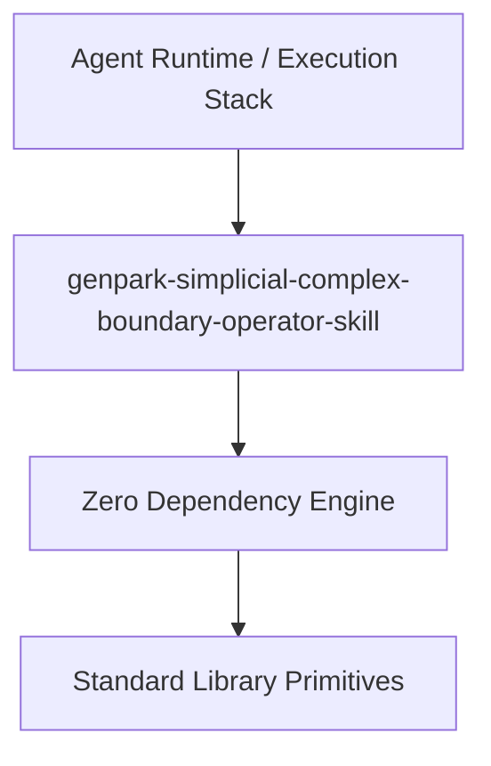

# genpark-simplicial-complex-boundary-operator-skill

[](https://github.com/Alpha-Park/genpark-simplicial-complex-boundary-operator-skill)
[](https://github.com/Alpha-Park/genpark-simplicial-complex-boundary-operator-skill)
[](https://www.python.org/)

Algebraic topology simplicial complex engine computing chain groups and boundary matrix operators verifying d^2 = 0.



## Features
- **Strict 0 Pip Dependencies**: Built completely using the Python Standard Library.
- **Fast Execution & Verification**: Includes client wrapper, MCP server, and verified test suites.
- **Agentic AI Ready**: Exposes standard MCP tools for continuous LLM integration.

## Installation & Quickstart
```bash
git clone https://github.com/Alpha-Park/genpark-simplicial-complex-boundary-operator-skill.git
cd genpark-simplicial-complex-boundary-operator-skill
python example_usage.py
```
